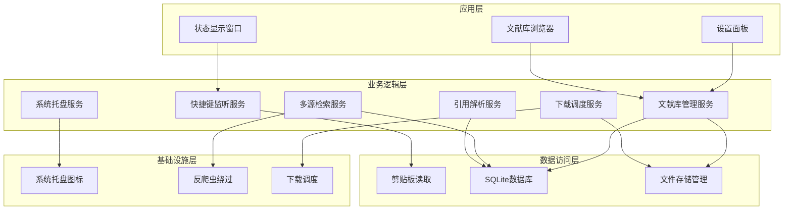

# OneShot -- 一键直达文献：基于快捷键的论文文献快速下载工具

## 一. 需求分析

**用户痛点场景（文字描述）：**

用户在使用PDF阅读器阅读学术文献时，发现一篇感兴趣的引用文献。首先选中该引用字符串，然后按下Ctrl+Shift+L快捷键。系统自动检测剪贴板内容，解析引用信息后，在多个学术数据库并行搜索文献。找到可用资源后自动下载，完成后通知用户。整个过程无需切换窗口，大大简化了文献获取流程。

**需求描述（100字以内）：**
科研人员阅读PDF文献时，选中文献引用字符串，按下快捷键即可自动解析引用、在多源学术数据库搜索、下载文献并存储。全程无需切换窗口、大幅简化文献获取流程，提升科研工作效率。

**核心特性：**
- 快捷键一键调用（Ctrl+Shift+L）
- 剪贴板自动检测引用字符串
- 多源并行搜索
- 自动下载存储

---

## 二. 功能流程设计

**业务功能流程（文字描述）：**

系统通过以下五个环节完成文献获取流程：首先是快捷键触发阶段，用户按下Ctrl+Shift+L组合键激活服务；然后读取剪贴板获取用户选中的文献引用字符串；接着调用AnyStyle解析器解析引用信息，提取标题、作者、DOI等元数据；随后在多个学术数据库并行搜索匹配文献；最后将找到的文献自动下载并保存到本地文献库中。

**流程图：**

**流程描述（100字以内）：**
用户选中PDF中的文献引用字符串，按下快捷键后，系统自动读取剪贴板内容，调用AnyStyle解析引用信息，从解析结果中提取标题/DOI，在多个学术数据库并行搜索，找到可用下载源后自动下载并存储到本地文献库。

---

## 三. 结构设计

**模块结构（文字描述）：**

系统采用分层架构设计，从上到下分为四个层次：

**应用层**使用NiceGUI构建本地Web界面，包含状态显示窗口、文献库浏览器和设置面板三个主要组件，提供用户交互界面。

**业务逻辑层**包含六个核心服务：快捷键监听服务使用pynput全局捕获键盘事件；引用解析服务调用AnyStyle解析文献引用；多源检索服务基于asyncio实现并行搜索；下载调度服务智能选择最优下载源；文献库管理服务和系统托盘服务提供后台支持。

**数据访问层**负责数据读写操作：剪贴板读取使用pyperclip库，SQLite数据库存储文献元数据，文件系统管理模块处理PDF/EPUB等文献文件的存储。

**基础设施层**提供底层支撑：系统托盘图标通过pystray和Pillow实现，反爬虫模块处理Cloudflare验证，下载调度使用httpx实现流式下载。

**模块结构图：**

**各模块描述（100字以内）：**
- **快捷键监听服务**：全局监听Ctrl+Shift+L，触发文献获取流程
- **引用解析服务**：调用AnyStyle解析引用字符串，提取标题/DOI/作者
- **多源检索服务**：并行查询多个学术数据库，聚合检索结果
- **下载调度服务**：智能选择最优下载源，自动处理下载流程
- **文献库管理服务**：提供文献的存储、分类、检索、导出功能
- **系统托盘服务**：常驻后台，支持托盘菜单操作

---

## 四. 交互设计

**核心交互流程：**
1. 用户在PDF阅读器（如Adobe Reader、 SumatraPDF、CAJViewer等）中选中文献引用
2. 按下 `Ctrl+Shift+L` 快捷键
3. 应用读取剪贴板内容，自动解析引用信息
4. 在多个学术数据库并行搜索
5. 找到可用文献后自动下载
6. 系统托盘通知用户下载完成

**人机交互界面：**
- **系统托盘**：常驻后台，显示运行状态，右键菜单提供快捷操作
- **状态浮窗**：下载进度、检索状态等实时显示（可最小化）
- **文献库页面**：浏览器访问localhost:8080查看/管理已下载文献
- **设置页面**：配置下载源、存储路径、快捷键等

**网络交互（文字描述）：**

用户操作流程中的网络交互涉及四个主要组件。剪贴板模块通过pyperclip读取用户选中的文献引用字符串，然后传递给FastAPI后端进行处理。后端调用AnyStyle引用解析服务，从引用字符串中提取标题、作者、DOI等元数据。最后，后端向多个学术数据库（如CrossRef、SciHub等）发起并行搜索请求，获取文献下载链接。整个过程中，FastAPI作为核心枢纽协调各服务模块的通信。

---

## 五. 运行部署环境设计

**部署架构（文字描述）：**

系统部署在Windows 10/11用户终端上，采用本地后台服务架构。应用以Python后台进程形式运行，常驻系统托盘，包含三个核心组件：快捷键监听模块（pynput）负责捕获全局快捷键，NiceGUI Web服务提供本地浏览器管理界面，下载服务模块（httpx）处理文献下载。系统依赖两个本地存储：SQLite数据库存储文献元数据索引，文件系统目录存储PDF/EPUB等文献文件。用户通过PDF阅读器选中引用文本后触发快捷键，后台服务自动完成文献获取全流程。

**运行环境（100字以内）：**
- Windows 10/11 操作系统
- Python 3.10+ 运行环境
- 后台常驻运行，系统托盘图标操作
- 本地浏览器访问 http://localhost:8080 管理文献库

---

## 六. 技术重难点及依据

| 重难点         | 技术方案                    | 依据/来源                                                                                           |
| -------------- | --------------------------- | --------------------------------------------------------------------------------------------------- |
| 全局快捷键监听 | pynput全局键盘钩子          | [moses-palmer/pynput](https://github.com/moses-palmer/pynput)                                       |
| 剪贴板读取     | pyperclip                   | Python剪贴板操作标准库                                                                              |
| 引用字符串解析 | AnyStyle (Ruby CRF)         | [inukshuk/anystyle](https://github.com/inukshuk/anystyle)                                           |
| 多源并行检索   | asyncio异步并发+超时控制    | Python asyncio文档                                                                                  |
| 反爬虫机制应对 | CloudflareBypassForScraping | [sarperavci/CloudflareBypassForScraping](https://github.com/sarperavci/CloudflareBypassForScraping) |
| PDF下载与存储  | httpx流式下载               | HTTP/1.1 RFC 7233                                                                                   |
| 文献元数据补全 | scholarly/CrossRef API      | [scholarly-python-package/scholarly](https://github.com/scholarly-python-package/scholarly)         |
| 现代化UI开发   | NiceGUI (Vue.js + FastAPI)  | [zauberzeug/nicegui](https://github.com/zauberzeug/nicegui)                                         |
| 系统托盘       | pystray + Pillow            | Windows系统托盘图标实现                                                                             |

---

## 七. 项目技术选型总结

### 7.1 核心框架

| 层级     | 选用技术 | 说明              |
| -------- | -------- | ----------------- |
| UI框架   | NiceGUI  | Python原生Web界面 |
| 后端框架 | FastAPI  | 异步高性能API框架 |
| 数据库   | SQLite   | 轻量级本地存储    |

### 7.2 快捷键与系统交互

| 工具      | 类型     | 说明                     |
| --------- | -------- | ------------------------ |
| pynput    | 键盘监听 | 全局快捷键捕获           |
| pyperclip | 剪贴板   | 读取剪贴板内容           |
| pystray   | 系统托盘 | 后台常驻，托盘图标与菜单 |

### 7.3 文献处理

| 工具                        | 类型   | 说明                           |
| --------------------------- | ------ | ------------------------------ |
| AnyStyle                    | 解析器 | 引用文献字符串解析（Ruby CRF） |
| scholarly                   | 数据源 | Google Scholar Python接口      |
| CloudflareBypassForScraping | 反爬虫 | 处理学术网站验证               |
| undetected-chromedriver     | 备选   | 绕过Distil/DataDome等反爬服务  |

### 7.4 辅助工具

| 工具          | 说明              |
| ------------- | ----------------- |
| httpx/aiohttp | 异步HTTP请求/下载 |
| Pillow        | 托盘图标图像处理  |

---

## 八. 运行环境依赖

- **操作系统**：Windows 10/11
- **Python**：3.10+
- **Ruby**（用于AnyStyle）：建议安装Ruby 3.0+
- **主要Python依赖**：NiceGUI, FastAPI, pynput, pyperclip, pystray, httpx, scholarly
- **可选依赖**：undetected-chromedriver (需要Chrome浏览器)
